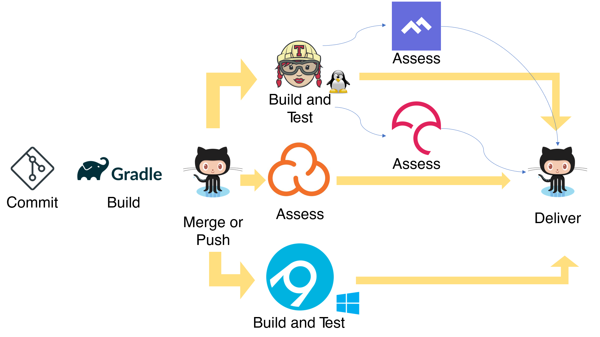

# FlapPy Bird (A python version of Flappy Bird Game)

The main purpose of this project is to demonstrate that you can build nice games on Python using PyGame. 

Initially, my idea was to use AI to play this game but later on I decided that this will make a project too complicated so I decided to keep things simple

As for me, the main idea around all this pet project was to get to know the concepts of Software Engineering.

[//]:#


----


AppVeyor:

[](https://ci.appveyor.com/project/ElijahOzhmegov/smake-snake-ai)

Travis-CI:

[]()

CodeCov:

[](https://codecov.io/gh/ElijahOzhmegov/Smake-Snake-AI-)

CodeClimate:

[](https://codeclimate.com/github/ElijahOzhmegov/Smake-Snake-AI-/test_coverage)
<a href="https://codeclimate.com/github/ElijahOzhmegov/Smake-Snake-AI-/maintainability"></a>

Sonarcloud:

[](https://sonarcloud.io/dashboard?id=ElijahOzhmegov_Smake-Snake-AI-)

[](https://sonarcloud.io/dashboard?id=ElijahOzhmegov_Smake-Snake-AI-)
[](https://sonarcloud.io/dashboard?id=ElijahOzhmegov_Smake-Snake-AI-)
[](https://sonarcloud.io/dashboard?id=ElijahOzhmegov_Smake-Snake-AI-)


[](https://sonarcloud.io/dashboard?id=ElijahOzhmegov_Smake-Snake-AI-)
[](https://sonarcloud.io/dashboard?id=ElijahOzhmegov_Smake-Snake-AI-)
[](https://sonarcloud.io/dashboard?id=ElijahOzhmegov_Smake-Snake-AI-)
[](https://sonarcloud.io/dashboard?id=ElijahOzhmegov_Smake-Snake-AI-)
## 1. UML
To create UML diagrams I used a PlantUML plugin in PyCharm.
### 1.1. Use Case Diagram
<p align="center">
  
</p>

### 1.2. Class Diagram
<p align="center">
  
</p>

### 1.3. Activity diagram
<p align="center">
  
</p>

## 2. Metrics

Besides the badges at the beginning of the page,
you can find additional information about used metrics
on the following pages:
* [sonarcloud.io](https://sonarcloud.io/dashboard?id=ElijahOzhmegov_Smake-Snake-AI-) 
page 
* [codeclimate](https://codeclimate.com/github/ElijahOzhmegov/Smake-Snake-AI-) page
* [codecov.io](https://codecov.io/gh/ElijahOzhmegov/Smake-Snake-AI-) page


## 3. Clean Code Development
During development were used  **Clean Code Development** principles
and PEP Conventions.

1. [Method Names and Instance Variables](https://pep8.org/#method-names-and-instance-variables):
    Use the function naming rules: lowercase with words separated by underscores as necessary to improve readability.
    ```python
    def __get_pos_on_screen(self, snake_pos):
        return snake_pos * self.scale_coef + self.scale_coef // 2
    ```
2. [Class Names](https://pep8.org/#class-names):
    Class names should normally use the CapWords convention.
    ```python
    class Playground(object):
        ...
    class Food:
        ...
    class Direction:
        ...
    ```
3. Function rules: Small, Do one thing, Use descriptive names:
    ```python
    def get_body(self):
        return self.__body
   
    def get_body_list(self):
        return [segment.get_pos() for segment in self.get_body()]

    def get_speed(self):
        return self.__speed.dir

    def get_position(self):
        return self.__position.pos

    def get_allowed_space(self):
        return self.__pg.rows, self.__pg.rows

    def get_seen_food_pos(self):
        return self.__food.get_pos()
    ```
4. Source code structure: Similar function should be close
    ```python
    def __is_injuring_itself(self, new_position):
        segments = [segment.pos for segment in self.__body]
        if new_position.get_pos() in segments:
            return True
        return False

    def __is_colliding_wall(self, new_position):
        if new_position.get_pos() in self.__borders:
            return True
        return False

    def get_body(self):
        return self.__body

    def get_body_list(self):
        return [segment.get_pos() for segment in self.get_body()]

    def get_speed(self):
        return self.__speed.dir

    def get_position(self):
        return self.__position.pos

    def get_allowed_space(self):
        return self.__pg.rows, self.__pg.rows

    def get_seen_food_pos(self):
        return self.__food.get_pos()

    def turn(self, new_dir):
        new_speed = self.__speed + Direction(direc=new_dir)
        if any(new_speed) != 0:
            self.__speed = Direction(direc=new_dir)

    def move(self):
        new_position = self.__position + Position(self.__speed.get_dir())

        if self.__is_injuring_itself(new_position):
            return Snake.self_collision

        if self.__is_colliding_wall(new_position):
            return Snake.wall_collision

        self.__position = new_position
        self.__move_body()
    ```
5. [Maximum Line Length](https://pep8.org/#maximum-line-length):
    Limit all lines to a maximum of 79 characters.
    ```python
    pygame.draw.rect(self.screen, Window.GREEN,
                     (x_pos - self.scale_coef // 2,
                      y_pos - self.scale_coef // 2,
                      self.scale_coef, self.scale_coef))
    ```
   Interesting fact: Python does not have namespaces like C++ or
   Java, so I use Constants logically attached to the class 
   (`Window.GREEN`). PEP keeps silence in this case.
   
[CCD Cheatsheet](https://user-images.githubusercontent.com/35653122/51113192-86f8d880-1801-11e9-90ad-88dd58854a18.png)

## 4. Build Management with PyGradle and Gradle
The easiest way to use Build Management system with
Python is [PyGradle](https://github.com/innobead/pygradle).
It does the following things:
* installs environment, dependencies
* launches tests
* builds python wheel
* generates docs (html and xml)

In current project:
* [build.gradle](build.gradle) file has instructions to build.
* [gradle_report.txt](gradle_report.txt) file is an output example.

To have possibility to launch gradle even without IDE
I have made a simple [bash script](launch_gradle.sh), that
does this. 

## 5. Unit-Tests
Although, the project has GUI, it was not covered by
tests by understandable reasons. Only the snake model 
was covered. 
[test_snake_model.py](tests/the_game/backend/test_snake_model.py)

## 6. Continuous Integration
Unfortunately my project does not have delivery part at least 
standard one like PyPI or some Python-based website. 
So Let's assume I  deliver my project just on github 
with all green/yellow 
values of the badges. So that all of them were green or at 
least yellow for such badges as test coverage.

My Pipeline: 


First of all, Travis-CI is responsible for Linux and 
AppVeyer for Windows.

Travis-CI service after the unit tests sends 
reports to CodeClimate.com and codecov.io.
Details can be found in **travis.yml** file for 
Travis and in **appveyor.yml**, **tox.ini** for AppVeyor.

* [Travis-CI report](https://travis-ci.org/ElijahOzhmegov/Smake-Snake-AI-)
* [AppVeyor report](https://ci.appveyor.com/project/ElijahOzhmegov/smake-snake-ai)

Gradle report usually looks like on the picture below.


## 7. IDE 

I have used PyCharm as my IDE.

I used such plugins as:
* Ace Jump - to boost my productivity while writing, running and debugging code.
* IdeaVim - also to make development process a bit faster
* PlantUML - to draw UML diagrams
* Sonar Lint - to help me polish my code a little bit :)

Here are my most favorite shortcuts in PyCharm IDE:
* Search everywhere (**Double ⇧**) 
* Run Anything (**Double Ctrl**) 
* Commit and Push (**Ctrl+Alt+K **)
* Suggestions... (**Ctrl+⇧ Shift+A**)
* SmartType Code Completion (**Ctrl+⇧ Shift+Space**)

## 8. DSL
Domain Specific Language was created to control the snake. You can see
usage example below.

<p align="center">
  
</p>

Gif looks worse than an original video, so below you can find the original video
and even an old video (one of the first attempts).

Full version of the video is available [here]() 
and [here]().

As you can see there is used vim navigation to control the snake
, because I am a fan of vim. Also, there was provided opportunity to
enter commands in lots of different ways. For example, instead of
to push `ENTER` 11 times to reach the food a player can just enter `11k`.
In addition a player can enter series commands for instance 
`5h k l k 23h`.

## 9. Functional Programming

* Final data structures

    There is tuple in my class **Direction**.
    ```python
    class Direction:
        up = (-1, 0)
        dn = (1, 0)
        lt = (0, -1)
        rt = (0, 1)
    ```
* Side effect free functions

    An instance:
    ```python
    def command_handler(command):
        if command in turns():
            dir = turns()[command]
            snake.turn(dir)
        elif command == 'q':
            return False
    return True
    ```

 * The use of higher order functions

    Below you can see a few artifical made examples: arg in fuction number is a tuple 
    that consist of a callback and int variable respectively.
     ```python
    def number(the_number, arg):
        return arg[0](the_number, arg[1]) if arg else the_number

    def zero (arg = None): return number(0, arg)
    def one  (arg = None): return number(1, arg)
    def two  (arg = None): return number(2, arg)
    def three(arg = None): return number(3, arg)
    def four (arg = None): return number(4, arg)
    def five (arg = None): return number(5, arg)
    def six  (arg = None): return number(6, arg)
    def seven(arg = None): return number(7, arg)
    def eight(arg = None): return number(8, arg)
    def nine (arg = None): return number(9, arg)


    def plus      (value): return int.__add__, value
    def minus     (value): return int.__sub__, value
    def times     (value): return int.__mul__, value
    def divided_by(value): return int.__floordiv__, value

    assert seven(times(five())) == 35
    assert four(plus(nine())) == 13
    assert eight(minus(three())) == 5
    assert six(divided_by(two())) == 3
     ```

* Functions as parameters and return values/anonymous functions

    When I was at school I often had to solve equastions like this:
    $ (a_1*x^2 + a_2^x + a_3) * x^2 + (a_4*x + a_5) * x + a_6 $
    ```python
    def quad(a, b, c):
        return lambda x: (a(x) if callable(a) else a)*(x ** 2) + \
                         (b(x) if callable(b) else b) * x + \
                         (a(x) if callable(c) else c)

    assert quad(0, 0, 3)(0) == 3
    assert quad(quad(1, 0, 0), quad(0, 2, 0), 3)(0) == 3
    ```

* Use Closures
    
    ```python
    def turns():
        TURNS = {'h': "lt", 'j': "dn", 'k': "up", 'l': "rt"}

        def nested_function():
            return TURNS

        return nested_function()

    ```


